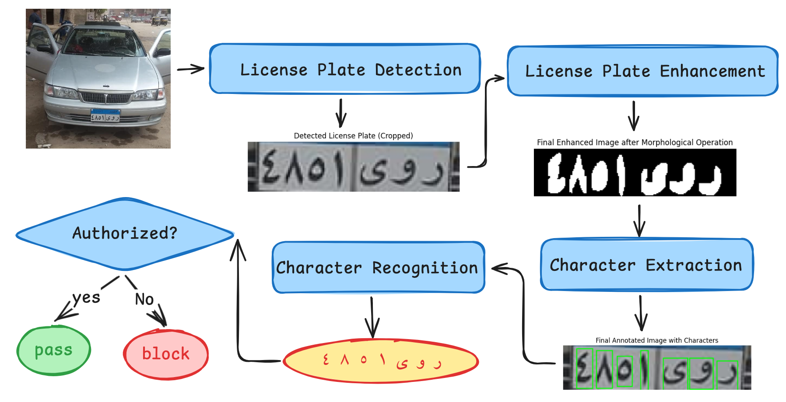
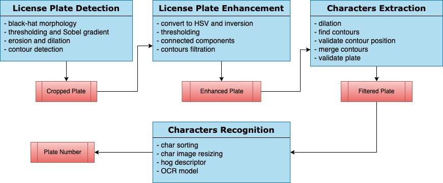

# Cerberus a Gate Access Controller

## Table of Contents

- [System Description](#about)
- [System Architecture](#system-architecture)
- [Used Algorithms](#used-algorithms)
- [Installation](#installation)
  - [Linux/MacOS](#to-run-the-project-on-linux-or-macos)
  - [Windows](#to-run-the-project-on-windows)

# System Description

<h3>A gate is open for specific cars based on their plate number. This
project aims to detect the plates of cars entering the high privilege
access buildings and areas to increase safety and make entering
easier and faster.
</h3>

# System Architecture



# Used Algorithms



## To run the project on Linux or MacOs

```bash
python -m venv venv
source venv/bin/activate
pip install -r requirements
python src/gate_access_app.py
```

## To run the project on Windows

```bash
python -m venv venv
.\venv\Scripts\activate
pip install -r requirements
python src/gate_access_app.py
```
